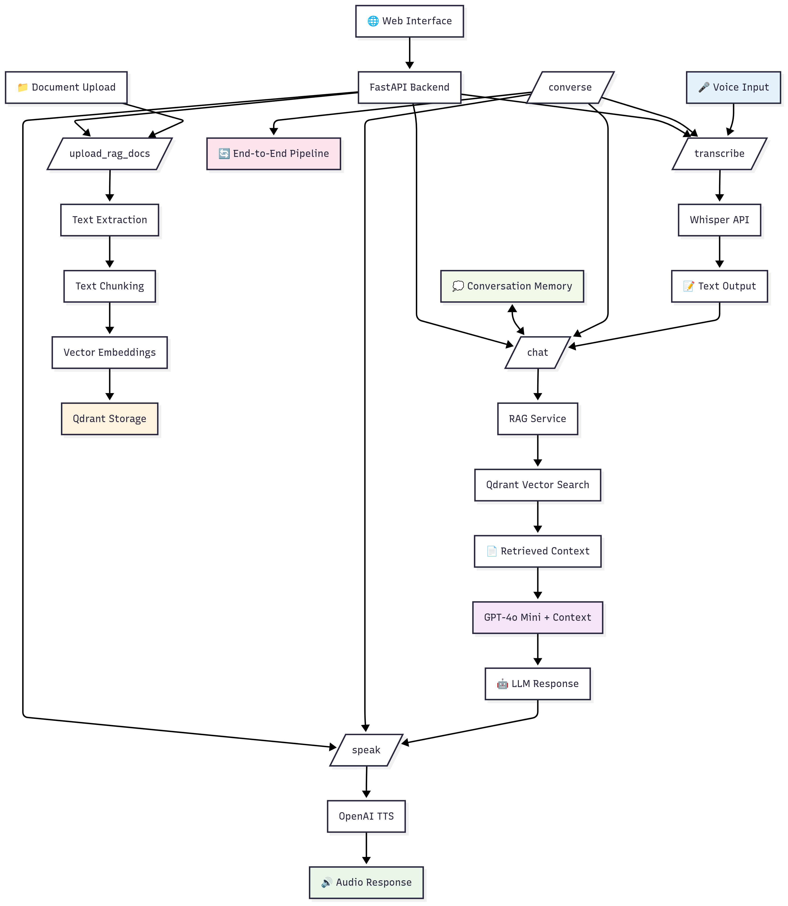

# Voice Conversational Agentic AI

A Python-based RESTful API application that enables bi-directional voice conversations with a Large Language Model (LLM), enhanced with Retrieval Augmented Generation (RAG) using proprietary real estate documents.

## 🎯 Features

- **Voice Input & Transcription**: Real-time voice capture with OpenAI Whisper API
- **LLM Text Processing**: OpenAI GPT-4o Mini with conversation memory
- **RAG Agent Integration**: Qdrant Cloud vector store for document retrieval
- **Text-to-Speech**: OpenAI TTS with multiple voice options
- **Smart Follow-up Queries**: Resolves references like "that property" to specific addresses
- **Granular Property Search**: Handles floor/suite specificity for multi-unit buildings

## 🏗️ Architecture



## 📋 API Endpoints

- Access the endpoints via http://localhost:8000/docs (or via curl) after you start the backend API, instructions below.

| Endpoint | Method | Description |
|----------|--------|-------------|
| `/transcribe` | POST | Voice to text conversion |
| `/chat` | POST | Text chat with LLM + RAG |
| `/speak` | POST | Text to speech conversion |
| `/converse` | POST | End-to-end voice conversation |
| `/reset` | POST | Clear conversation memory |
| `/upload_rag_docs` | POST | Upload knowledge base documents |

## 🚀 Quick Start

### Prerequisites

- Python 3.8+
- OpenAI API key
- Qdrant Cloud account

### Installation

1. Clone the repository:
```bash
git clone https://github.com/seraphimsakiewicz/okada-hackathon
cd okada-hackathon
```

2. Install dependencies:
```bash
pip install -r requirements.txt
```

3. Set up environment variables:
```bash
cp .env.example .env
# Edit .env with your API keys
```

4. Run the backend API:
```bash
python main.py
```

**IMPORTANT:** On first startup, the API automatically indexes the included real estate knowledge base
(`HackathonInternalKnowledgeBase.csv`) if no documents are found in the vector database. This
ensures RAG functionality works immediately. You can still upload additional documents using the
`/upload_rag_docs` endpoint - , but they will be added to the existing knowledge base.

If you'd like to prevent the automatic indexing of the `HackathonInternalKnowledgeBase.csv`, feel
free to remove it BEFORE running python main.py

5. Run the Flask frontend (in a new terminal):
```bash
python frontend.py
```

The API will be available at `http://localhost:8000`
The Web UI will be available at `http://localhost:5000`

## 🔧 Configuration

Create a `.env` file with the following variables:

```env
OPENAI_API_KEY=your_openai_api_key_here
QDRANT_URL=your_qdrant_cluster_url
QDRANT_API_KEY=your_qdrant_api_key
QDRANT_COLLECTION_NAME=voice_ai_documents
```

## 📚 Usage Examples

### Web Interface (Recommended)
Visit `http://localhost:5000` for the interactive web interface featuring:
- **Voice Recording**: Click to start/stop recording
- **Text Chat**: Type questions and get responses
- **Audio Playback**: Hear responses spoken back to you
- **Example Queries**: Click pre-made examples to test

### API Usage

#### Basic Chat
```bash
curl -X POST -H "Content-Type: application/json" \
  -d '{"conversation_id": "test1", "message": "Hello"}' \
  http://localhost:8000/chat
```

#### Property Query
```bash
curl -X POST -H "Content-Type: application/json" \
  -d '{"conversation_id": "test1", "message": "Who manages 36 W 36th St?"}' \
  http://localhost:8000/chat
```

#### Follow-up Query
```bash
curl -X POST -H "Content-Type: application/json" \
  -d '{"conversation_id": "test1", "message": "What is the rent for that property?"}' \
  http://localhost:8000/chat
```

#### Voice Conversation
```bash
curl -X POST -H "Content-Type: application/json" \
  -d '{"conversation_id": "voice1", "message": "Tell me about Times Square properties"}' \
  http://localhost:8000/converse
```

#### Upload Additional Documents
```bash
curl -X POST "http://localhost:8000/upload_rag_docs" \
  -F "files=@your_document.pdf" \
  -F "files=@another_document.txt"
```

## 🧪 Testing

The project includes testing scripts to ensure RAG and API responses are working properly based on
provided initial and followup queries.

### Test All Properties
```bash
# Test first 25 properties
python test_all_properties.py --limit 25

# Test specific range
python test_all_properties.py --start 199 --limit 25

# Test all properties
python test_all_properties.py
```

### Test Results
Recent comprehensive testing shows:
- **96% success rate** across diverse address formats
- **98% average accuracy** in associate matching
- **2.57s average response time**

## 🏢 RAG Knowledge Base

The system includes a real estate knowledge base with:
- **226 properties** across NYC
- **Multiple address formats**: Streets, Avenues, Broadway, Times Square
- **Granular details**: Floor and suite-level information
- **Associate information**: Property managers and brokers
- **Financial data**: Rent rates, annual/monthly costs

### Supported Address Formats
- Standard streets: "36 W 36th St"
- Avenues: "345 Seventh Avenue"
- Special locations: "9 Times Sq"
- Broadway addresses: "1412 Broadway"
- Complex ranges: "121-127 W 27th St"

## 🎤 Voice Features

### Supported Audio Formats
- WAV, MP3, M4A, FLAC, OGG

### TTS Voices
- alloy (default)
- echo
- fable
- onyx
- nova
- shimmer

## 🔍 Smart Follow-up Resolution

The system intelligently resolves follow-up queries:

## 📊 Performance Metrics

All endpoints return timing information:
- `transcribe_time`: Speech-to-text processing
- `chat_time`: LLM + RAG processing  
- `tts_time`: Text-to-speech generation
- `total_time`: End-to-end processing

## 🔒 Security

- API keys stored in environment variables
- No sensitive data in repository
- Rate limiting for API protection
- Input validation and error handling

## 📁 Project Structure

```
okada-hackathon/
├── main.py                 # FastAPI application
├── src/
│   ├── clients/           # API client configurations
│   ├── services/          # Core business logic
│   └── config.py          # Settings management
├── rag_data/              # Knowledge base documents
├── audio_output/          # Generated TTS files
├── test_all_properties.py # Comprehensive testing
└── requirements.txt       # Dependencies
```

## 📄 License

This project is licensed under the MIT License.